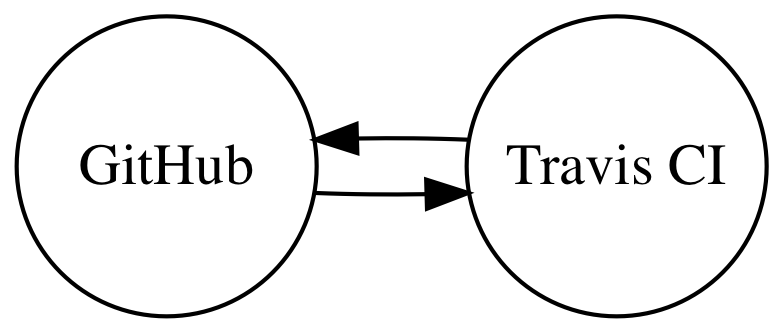

# boot / ⠛⠕⠞⠞⠁⠀⠃⠕⠕⠞⠀⠮⠀⠍⠑⠞⠁⠍⠁⠡⠔⠑ / DEFUNCT

[](https://travis-ci.org/casey/boot)
[](https://gitter.im/boot-the-metamachine/Lobby)

[wut?](https://youtu.be/TURoRXbWBWk)

## metamachine scoring

0. Rules:

    ⅰ. Aside from one-time costs, a proper metamachine should not require ongoing funding to continue functioning. You may find [this list](https://github.com/ripienaar/free-for-dev/blob/master/README.md) of free resources useful.

    ⅱ. A metamachine should continue operating indefinitely without the creator's interaction or intervention.

1. Create a graph of your metamachine. Nodes are services, machines, and APIs. Edges are interactions.

2. Use the following rubric to determine your metamachine's score:
```
score =
    (length of the longest loop in the graph - 1)
  + (number of unique node types - 2)
  + (monthly resource cost / $100)
  + new tos clause       * 4   # was a clause added to a service's TOS to outlaw your metamachine?
  + is useful            * 8   # does the metamachine provide a useful service?
  + creative node types  * 16  # minecraft servers, excel spreadsheets, etc involved
  + has human cog        * 32  # is there an unwitting human somewhere in the loop?
  + is turing complete   * 64  # is the metamachine capable of arbitrary computation?
  + cannot be stopped    * 128 # is it impossible to stop the metamachine?
```

3. Submit link(s) to your metamachine, a graph of its architecture, its score according to the above rubric, along with your rationale for that score to <casey@rodarmor.com>.

## [boot.is](http://boot.is) score

0. Compliance:

    i. No ongoing resource costs. The `boot.is` domain did cost money, but it not required for the ongoing function of the metamachine.

1. Architecture diagram:
    

2. Score:

```
  1pt # longest loop is 2 edges, minus 1
  0pt # two node types, minus 2
  0pt # monthly resource cost is < $100
  0pt # not useful
  0pt # no creative node types
  0pt # no human cogs
  0pt # is not turing complete
+ 0pt # can be stopped
-----
  1pt # total
```
